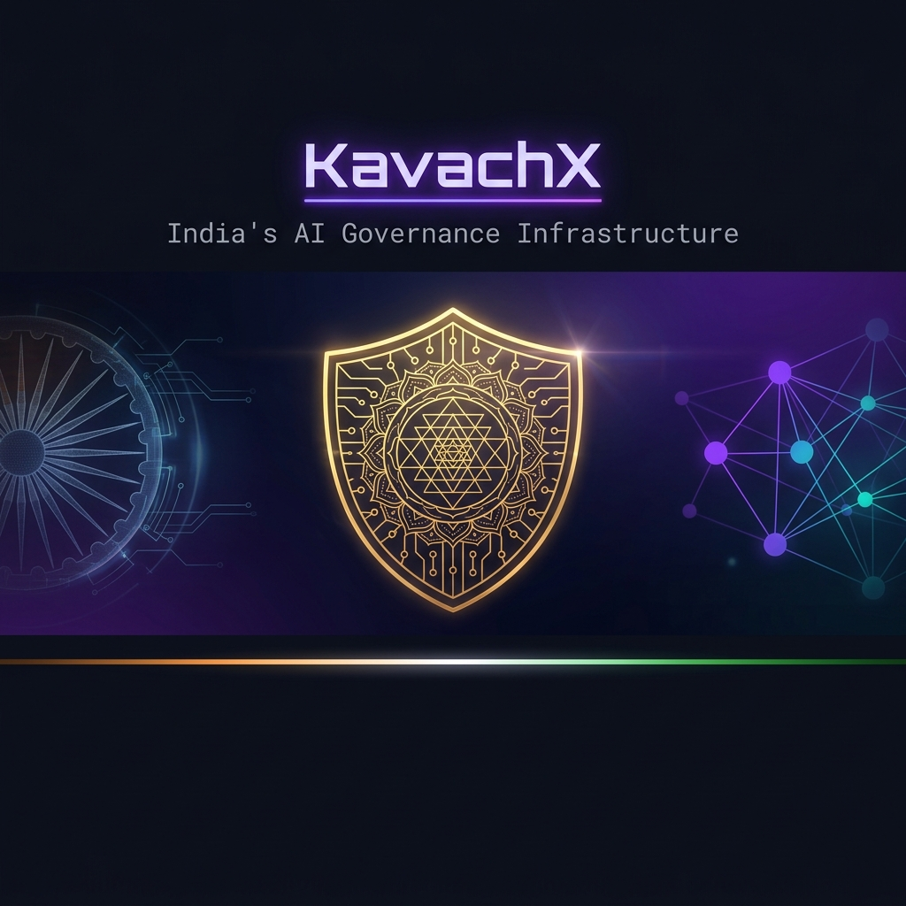

<!-- BANNER -->
<div align="center">
  
</div>

<!-- ANIMATED TYPING SVG -->
<div align="center">
  <br/>

  [](https://git.io/typing-svg)

  <br/>

  [](https://github.com/TheIndicSentinel)
  &nbsp;
  [](https://github.com/TheIndicSentinel?tab=followers)
  &nbsp;
  [](https://github.com/TheIndicSentinel)

</div>

---

<!-- IDENTITY SECTION -->
<table>
<tr>
<td width="60%" valign="top">

## 🛡️ The Mandate

I am an **AI/ML Engineer & Governance Architect** building the **trust infrastructure** that responsible AI in Bharat demands.

In a nation where **1.4 billion lives** are being touched by algorithmic decisions — in credit, healthcare, hiring, and public services — the enforcement of **policy-aligned AI** isn't idealism. It's engineering necessity.

My work is at the intersection of:
- 🏛️ **AI Safety** — preventing harm before it propagates
- ⚖️ **Digital Law** — DPDP Act, IT Act, emerging AI frameworks
- 🔬 **ML Systems** — classifiers that understand *context*, not just keywords
- 🏗️ **Infrastructure** — governance as a first-class engineering concern

> *"In the age of AI, the question is not just what machines can do — but what they* **should** *do. And who enforces it."*

</td>
<td width="40%" valign="top" align="center">

<br/><br/>

```python
class TheIndicSentinel:
    role    = "AI Governance Architect"
    mission = "Bharat's Digital Armor for AI"
    law     = ["DPDP Act", "IT Act 2000",
               "AI Accountability Norms"]
    stack   = ["Python", "FastAPI",
               "PyTorch", "React", "Docker"]

    def philosophy(self):
        return (
            "Build systems that are not just "
            "intelligent — but accountable."
        )
```

</td>
</tr>
</table>

---

<!-- KAVACHX FLAGSHIP SECTION -->
## ⚡ KavachX — The Enforcement Engine

<div align="center">

> **KavachX** is not a library. It is not a tool. It is a **governance infrastructure** — the policy firewall that stands between AI models and the real world.

</div>

<table>
<tr>
<td width="25%" align="center">

### 🔍 Real-Time Interception
Every LLM inference is intercepted, analyzed across **composite risk dimensions**, and scored before a single token reaches the end-user.

</td>
<td width="25%" align="center">

### 🧬 ML-Native Safety
Custom-trained safety classifiers built for **Indian linguistic context** — understanding nuance, intent, and domain-specific harm patterns.

</td>
<td width="25%" align="center">

### 📜 Audit Integrity
**Immutable audit chains** with cryptographic logging. Every decision is timestamped, stored, and surfaced on a live executive compliance dashboard.

</td>
<td width="25%" align="center">

### 🌐 Ubiquitous Layer
From headless **API middleware** (FastAPI) to **browser-level interception** (Chrome Extension) — governance is woven into the fabric, not bolted on.

</td>
</tr>
</table>

<div align="center">

[](https://github.com/TheIndicSentinel/kavachxv2)
&nbsp;
[](https://python.org)


</div>

---

<!-- GOVERNANCE PILLARS -->
## 🏛️ Governance Architecture: 4 Enforcement Gates

```
                    ┌─────────────────────────────────────────┐
                    │         AI MODEL (LLM / ML System)       │
                    └──────────────────┬──────────────────────┘
                                       │ Inference Request
                                       ▼
        ╔══════════════════════════════════════════════════════╗
        ║              K A V A C H X   E N G I N E            ║
        ║──────────────────────────────────────────────────────║
        ║  Gate 1: 🔐 Security    │  Prompt Injection / NAEL   ║
        ║  Gate 2: 🧬 Safety      │  Hate, Bias, Harm Scoring  ║
        ║  Gate 3: 📋 Compliance  │  DPDP PII / IT Act Check   ║
        ║  Gate 4: 📊 Audit       │  Immutable Log + Dashboard ║
        ╚══════════════════════════════════════════════════════╝
                                       │ Governed Response
                                       ▼
                    ┌─────────────────────────────────────────┐
                    │              END USER / CLIENT            │
                    └─────────────────────────────────────────┘
```

---

<!-- FEATURED PROJECTS -->
## 🚀 Featured Projects

<table>
<tr>
<td width="50%" valign="top">

### 🛡️ KavachX — AI Governance Engine
> *The enforcement layer for production AI in Bharat*

A real-time governance platform acting as the **middle-layer for AI interactions**. Implements composite risk scoring, ML-native safety classifiers, and an immutable compliance audit chain.

**Capabilities:**
- ⚡ Sub-100ms inference risk scoring
- 🔒 DPDP / IT Act compliance enforcement
- 🧬 Fine-tuned domain safety classifiers
- 🌐 Browser-level AI interception (Chrome)
- 📊 Live executive compliance dashboard

[](https://github.com/TheIndicSentinel/kavachxv2)

</td>
<td width="50%" valign="top">

### 🗣️ VyaparGPT — Bharat SME Intelligence
> *Business intelligence for India's 63 million SMEs*

An **LLM-powered bilingual assistant** enabling Indian traders to query inventory, sales, and business health in natural language — Hindi or English.

**Capabilities:**
- 🗣️ Hindi + English NLP query interface
- 📈 AI-driven sales & inventory insights
- 🇮🇳 Tailored for the Bharat SME market
- ⚡ Context-aware business analytics

[](https://github.com/TheIndicSentinel/vyapar_gpt)

</td>
</tr>
<tr>
<td width="50%" valign="top">

### 📋 PO CoPilot — AI Procurement
> *AI assistant for enterprise procurement workflows*

A **Streamlit-based AI assistant** for purchase order validation, change impact analysis, and approval summary automation — aligned with SAP BTP patterns.

**Capabilities:**
- 🔍 Multi-field PO validation & risk flagging
- 📋 Automated approval summaries
- ☁️ SAP BTP-aligned architecture
- 🤖 AI-powered change impact analysis

[](https://github.com/TheIndicSentinel/PO-Copilot)

</td>
<td width="50%" valign="top">

### 💪 Mpower Fitness Platform
> *SaaS infrastructure for the fitness economy*

A **multi-role fitness SaaS** with real-time trainer-client management, streak analytics, and indigenous UPI payment deep-links.

**Capabilities:**
- 💬 Real-time chat via Socket.IO
- 📊 Streak tracking & activity analytics
- 💳 UPI deep-link payment ecosystem
- 🏋️ Scalable Node.js / PostgreSQL backend

[](https://github.com/TheIndicSentinel/mpowerfitness)

</td>
</tr>
</table>

---

<!-- ROADMAP -->
## 🗺️ Active Roadmap: The Next Frontier

```
Q2 2026  ──────────────────────────────────────────────────────────►
│
├── 🧬  Bhasha-Shield
│       High-speed safety filter for Indian languages (Indic-NLP)
│       Detecting prompt injection in Hindi, Tamil, Bengali, Telugu
│
├── 🔐  PrivacyConnect SDK
│       Lightweight middleware bridging LLM agents with India Stack
│       Account Aggregator + ONDC in a DPDP-compliant wrapper
│
├── 📦  DPDPA-Masker (OSS Package)
│       Pip-installable PII redaction tool built for Indian data patterns
│       Targets: Aadhaar, PAN, UPI IDs, Indian phone formats
│
└── 📊  Governance-as-Code
        Terraform provider for AI safety policies
        Automate compliance across cloud environments at scale
```

---

<!-- GITHUB STATS -->
## 📊 Intelligence Dashboard

<div align="center">

<table border="0">
  <tr>
    <td align="center">
      
    </td>
    <td align="center">
      
    </td>
  </tr>
</table>


</div>

---

<!-- CONTRIBUTION SNAKE (requires GitHub Action setup) -->
## 🐍 Contribution Activity

<div align="center">

<picture>
  <source media="(prefers-color-scheme: dark)" srcset="https://raw.githubusercontent.com/TheIndicSentinel/TheIndicSentinel/output/github-contribution-grid-snake-dark.svg" />
  <source media="(prefers-color-scheme: light)" srcset="https://raw.githubusercontent.com/TheIndicSentinel/TheIndicSentinel/output/github-contribution-grid-snake.svg" />
  
</picture>

</div>

---

<!-- TROPHIES -->
## 🏆 Achievements

<div align="center">
  
</div>

---

<!-- TECH STACK -->
## 🛠️ Arsenal

<div align="center">

**Core Engineering**


**ML / AI Governance**


**Frontend & Interfaces**


**Infrastructure & Data**


</div>

---

<!-- CURRENT FOCUS -->
## 🔭 Current Focus

<div align="center">

| Initiative | Status | Description |
|:---|:---:|:---|
| 🛡️ KavachX v3.6 — ML Hardening | 🟢 Active | Fine-tuning domain safety classifiers for general AI safety |
| 📋 DPDP Compliance Engine | 🟢 Active | Tightening PII detection with Bharat-native data patterns |
| 🧬 Bhasha-Shield (Indic NLP) | 🟡 Research | Multilingual safety filter for Indian dialect prompt attacks |
| 📦 DPDPA-Masker OSS Package | 🔵 Planned | Public pip package for DPDP-aligned PII redaction |
| ✍️ Technical Blog (Hashnode) | 🔵 Planned | Engineering deep-dives on AI governance architecture |

</div>

---

<!-- CONNECT -->
## 📡 Connect

<div align="center">

*Building in public. Reach out if you're working on AI safety, Indian AI policy, or responsible ML infrastructure.*

<br/>

[](https://linkedin.com/in/your-linkedin)
&nbsp;
[](mailto:your@email.com)
&nbsp;
[](https://github.com/TheIndicSentinel)

<br/>

---

<sub>
  <b>🛡️ KavachX</b> — Policy-Aligned AI Infrastructure for Bharat &nbsp;|&nbsp;
  Built with conviction in 🇮🇳 India
</sub>

</div>
