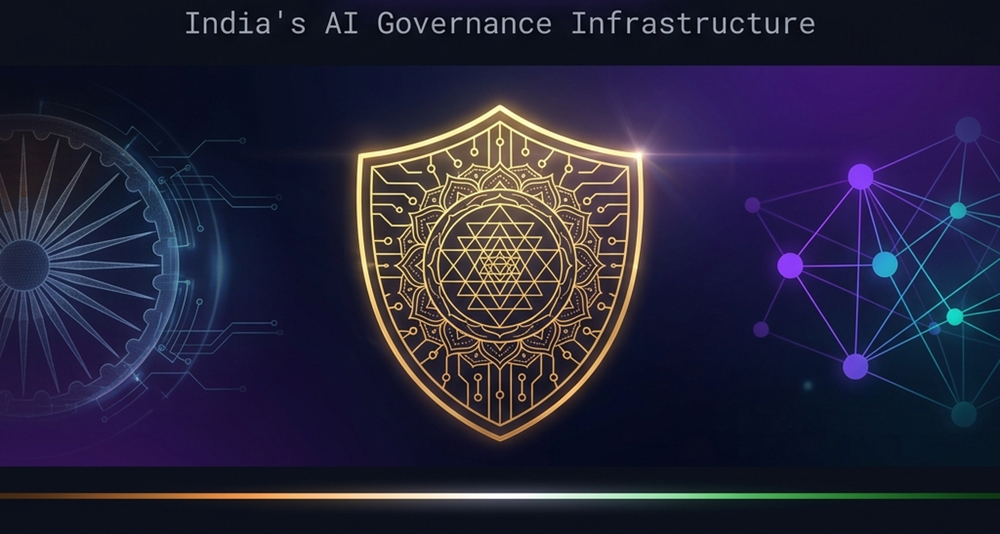

<div align="center">
  
</div>

<div align="center">
<br/>

[](https://git.io/typing-svg)

<br/>

[](mailto:inerd1412@gmail.com)
&nbsp;
[](https://www.linkedin.com/in/mallikarjun-r-6159b5333/)

</div>

---

## ⚡ The Architect

<table>
<tr>
<td width="58%" valign="top">

I'm **Arjun** — an AI/ML engineer and governance architect in **Bharat 🇮🇳**, building the trust infrastructure responsible AI needs.

Deploying AI for fintech, HR and healthtech made one thing clear: **enforcement was missing**. Systems were intelligent; none were accountable.

That became **Kavach**: authorization for AI agents and automated decisions, where authority comes from a business event, not from a model.

**What drives me:**
- 🏛️ AI that is **accountable** to the people it affects
- ⚖️ Rules **enforced in code**, not just on paper
- 🔒 **Less data collected**, more user control
- 🇮🇳 Building **for Bharat**, not adapting what others built

</td>
<td width="42%" valign="top">

```rust
struct TheIndicSentinel {
    name: "Arjun",
    mission: "Digital armor for AI",
    now: "Kavach (Rust core)",
    principle: "Not just intelligent. Accountable.",
}
```

</td>
</tr>
</table>

---

## 🛡️ Kavach — Current State

> Authorization and runtime control for AI agents. Free and open source (Apache-2.0). **Pre-release: not production-ready, no external security review yet.**

An agent should not hold the credential to act unless it is authorised to act. Every action needs a signed **Task Mandate** issued from a system-of-record event, is checked against Cedar policy, trusted time and server-side counters, is recorded as signed evidence **before** it runs, and only then gets a short-lived credential bound to that exact request.

| Area | Status |
|---|---|
| Task Mandates (issue, delegate, revoke) | ✅ |
| Cedar agent policies, formally analysed in CI (cvc5) | ✅ |
| Signed tool registry, reference-only parameters | ✅ |
| Signed, hash-chained evidence, committed before execution | ✅ |
| Short-lived credentials (JWS in JWE, ≤ 15 s) | ✅ |
| Gateway, acceptance suite, network isolation (deployed stack) | ✅ built, still pre-release |
| Signed evidence checkpoints, export, offline verifier | 🚧 in progress |
| Developer CLI: `kavach init`, `demo`, `authorize`, `why`, `attack` | 🗺️ v0.1 preview |

<div align="center">

[](https://github.com/TheIndicSentinel/Kavach)
&nbsp;


</div>

```
 Agent ──► Gateway ──► Mandate ► Cedar policy ► Trusted time ► Counters
                          │
                          ▼
              Signed evidence (before action)
                          │
                          ▼
        Short-lived credential ──► Provider ──► Signed outcome
```

---

## 🗺️ Roadmap

| Phase | Focus |
|---|---|
| **Now** | Evidence checkpoints, export and offline verification |
| **v0.1 preview** | Developer CLI first: `kavach init`, `demo`, offline `authorize`, `why`, `attack`; supply-chain hardening, benchmarks, fuzzing, open KMS/HSM adapter |
| **v0.2** | `kavach studio` terminal UI (read-only, no telemetry) |
| **Later** | Approvals and step-up, taint tracking, MCP adapter, RBI/DPDP evidence packs, multi-tenant and HA reference, external security review |

## 🔭 Vision

An open, auditable control layer between AI agents and the systems they touch, so regulated Indian lenders can **prove** what an agent was allowed to do and why. Security properties stay free; an optional enterprise plane (fleet management, SSO, audit-export packs) lives in a separate repo. See [OPEN_CORE.md](https://github.com/TheIndicSentinel/Kavach/blob/main/OPEN_CORE.md).

---

## 🚀 Other Projects

| Project | What it is |
|---|---|
| [KavachX v2](https://github.com/TheIndicSentinel/kavachxv2) | Earlier Python governance engine: risk scoring, safety classifiers, audit chain |
| [dpdpa-pii-scrubber](https://github.com/TheIndicSentinel/dpdpa-pii-scrubber) | Zero-dependency redaction of Aadhaar, PAN, UPI, IFSC and other Indian identifiers |
| [Awesome AI Governance Bharat](https://github.com/TheIndicSentinel/awesome-ai-governance-bharat) | Curated laws, frameworks, tools and research for Indian AI governance |
| [VyaparGPT](https://github.com/TheIndicSentinel/vyapar_gpt) | Hindi and English assistant for Indian SMEs |

## 🛠️ Arsenal

<div align="center">


</div>

---

<div align="center">

*Building in public. Reach out if you work on AI safety, Indian AI policy or responsible ML infrastructure.*

<sub><b>🛡️ Kavach</b> — Accountable AI infrastructure · Built with conviction in 🇮🇳 India</sub>

</div>
